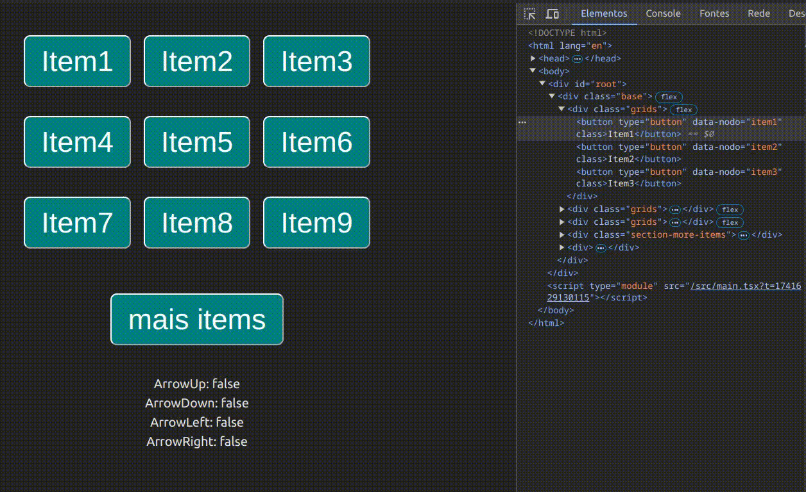

# Navigation nodos

[View demo](https://gabrielogregorio.github.io/navigation-nodos/)

This project consists of code that allows navigation via keyboard/gamepad using the arrows or control, focusing on the nodes, and can be used with typescript, javascript, react, pure javascript and potentially in other ways as well.



## How to use?

Below is an example with react, but you can use it with any other method.

Note that it is mandatory to use `data-node` to identify the navigable nodes.

```tsx
import { useEffect } from 'react';
import { useKeyPress } from './useKeyPress';
import { generateNavigationMapClosestNodo } from './navigationNodos/generateNavigationMapClosestNodo';
import { handleNavigation } from './navigationNodos/handleNavigation';

function App() {
  const key = useKeyPress(); // any navigation method
  // const key = useGamePadPs2() // example
  // const key = useGesture() // example

  useEffect(() => {
    // use here if the node map is very dynamic
    const map = generateNavigationMapClosestNodo();

    if (key.ArrowDown) {
      handleNavigation('down', map);
    } else if (key.ArrowUp) {
      handleNavigation('up', map);
    } else if (key.ArrowLeft) {
      handleNavigation('left', map);
    } else if (key.ArrowRight) {
      handleNavigation('right', map);
    }
  }, [key]);

  return (
    <div>
      <div>
        <button type="button" data-nodo="item1">
          Item1
        </button>
        <button type="button" data-nodo="item2">
          Item2
        </button>
        <button type="button" data-nodo="item3">
          Item3
        </button>
      </div>
    </div>
  );
}
```

## How does it work?

The `generateNavigationMapClosestNodo` function maps the location of the nodes with the `data-node` attribute and their respective positions, thus being able to calculate which nodes are above or below others.

This is an example of how to make a node mappable, just use the `data-node` attribute with `unique values`.

```html
<div className="grids">
  <button type="button" data-nodo="item1">Item1</button>
  <button type="button" data-nodo="item2">Item2</button>
  <button type="button" data-nodo="item3">Item3</button>
</div>
```

Baseado nesse rastreamento, a função `generateNavigationMapClosestNodo` irá gerar um objeto nesse formato.

```js
{
  'item1': {
    up: null
    down:null
    left:null
    right: 'item2'
  },
  'item2': {
    up:null
    down:null
    left:'item1'
    right:'item3'
  },
  'item3': {
    up:null
    down:null
    left: 'item2'
    right: null
  },
};
```

And based on this map, the `handleNavigation` function will receive the direction, for example `left`, the map of the nodes, then it will find the focused node, and based on the map it will know which node is in which position, imagining that the node `item2` is the focused one, then we will have

```js
{
  up: null;
  down: null;
  left: 'item1';
  right: 'item3';
}
```

And since the direction is `left`, then `handleNavigation` will know that it should focus on `item1`.

This is how this navigation system works.

> The system gets the position of the nodes only through `getBoundingClientRect`, without considering width or height, so it is recommended that you use this tactic for navigation in layouts with gaps.

## I want to contribute

You can open pull requests directly in this repository, your contributions will be welcome if they bring improvements to the functionality, without complicating things too much.
